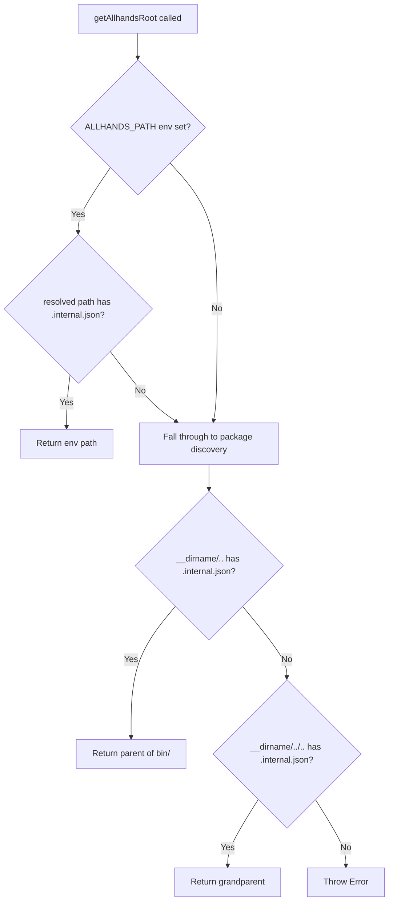

# Path Resolution

[ref:src/lib/paths.ts:getAllhandsRoot:827a9fa] is the single function responsible for answering: "where are the allhands source files?" Every command depends on this answer to locate the manifest, distributable files, and configuration.

## Resolution Strategy

## Two Discovery Modes

| Mode | When | How |
|---|---|---|
| **Env var** | Local development, testing | `ALLHANDS_PATH` points directly to the repo root |
| **Package-relative** | Production (`npx` usage) | Walks up from the bundled `bin/cli.js` location |

The `.internal.json` file serves as a sentinel -- its presence confirms the directory is a valid allhands root. This avoids false positives from similarly-named directories.

## Package-Relative Traversal

After esbuild bundles the CLI into `bin/cli.js`, the runtime `import.meta.url` resolves to that file's location. The function tries two levels of parent traversal:
- One level up: handles `bin/cli.js` -> package root
- Two levels up: handles `dist/lib/paths.js` -> package root (unbundled development)

## Upstream Constants

[ref:src/lib/paths.ts:UPSTREAM_REPO:827a9fa] and [ref:src/lib/paths.ts:UPSTREAM_OWNER:827a9fa] define the canonical upstream repository coordinates. These are used exclusively by the push command for fork and PR operations. Hardcoding them (rather than reading from git remotes) ensures push always targets the correct upstream regardless of the user's remote configuration.
